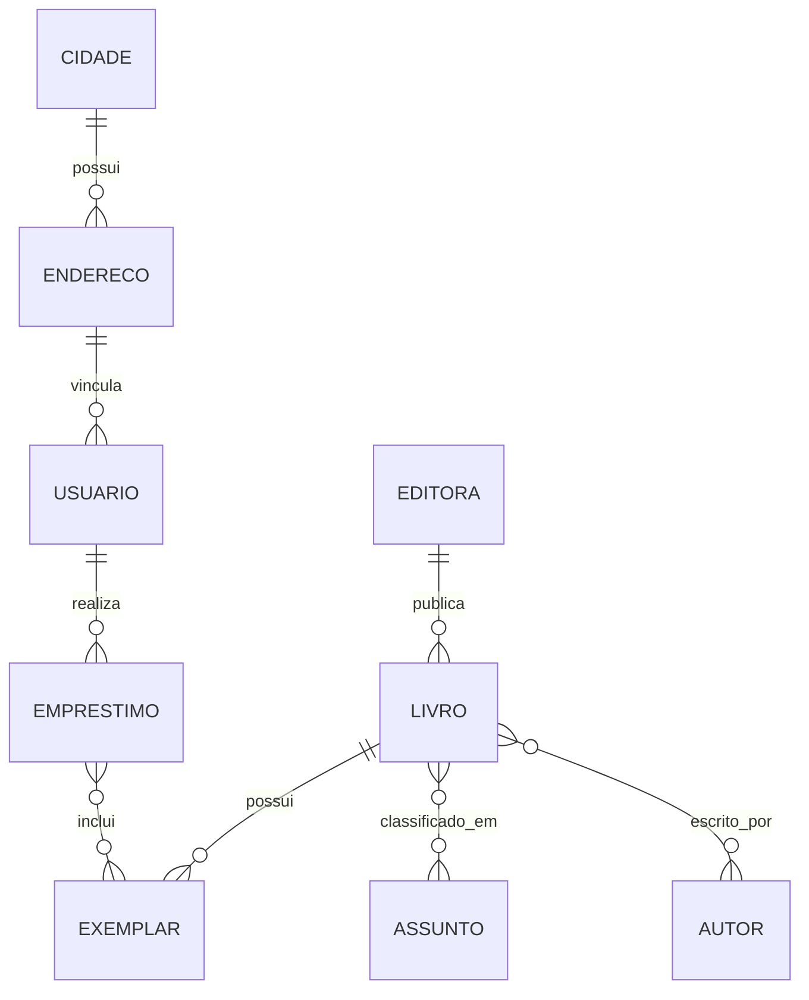

# Sistema de Biblioteca — Banco de Dados MySQL

Projeto acadêmico desenvolvido na disciplina de **Banco de Dados I** do curso de **Análise e Desenvolvimento de Sistemas no IFRS Erechim**.

O repositório apresenta a evolução de um primeiro modelo relacional para uma versão revisada de um sistema de biblioteca, contemplando catálogo, autores, assuntos, usuários, endereços, exemplares físicos e empréstimos.

## O que este projeto demonstra

- modelagem de entidades e relacionamentos;
- normalização e separação de responsabilidades;
- relacionamentos 1:N e N:N;
- chaves primárias, estrangeiras e compostas;
- constraints de domínio e integridade referencial;
- dados de demonstração idempotentes;
- consultas com `JOIN`, agregações, `GROUP BY` e `CASE`;
- validação automática dos scripts com MySQL no GitHub Actions.

## Modelo atual



## Principais correções da evolução

| Problema da primeira versão | Solução atual |
|---|---|
| CEP associado à cidade | CEP pertence ao endereço |
| Empréstimo ligado ao título por quantidade | Empréstimo referencia exemplares físicos identificados por tombo |
| Nomes e tipos inconsistentes | Convenção única em `snake_case` e tipos adequados |
| Poucas regras de integridade | Chaves únicas, `CHECK`, ações de FK e datas coerentes |
| Script único e difícil de testar | Estrutura, dados e consultas separados |

## Estrutura

```text
.
├── .github/workflows/
│   └── mysql-validation.yml
├── database/
│   ├── schema.sql
│   ├── seed.sql
│   └── queries.sql
├── legacy/
│   └── original-submission.sql
├── .env.example
└── compose.yml
```

O arquivo em `legacy/` é a entrega original da disciplina. Ele foi mantido para que a evolução da modelagem possa ser comparada, mas não deve ser usado para criar o banco atual.

## Executando com Docker

```bash
git clone https://github.com/Liken77/Banco-de-Dados-Projeto.git
cd Banco-de-Dados-Projeto
cp .env.example .env
docker compose up -d
```

Na primeira execução, o MySQL aplica automaticamente `schema.sql` e `seed.sql`.

Para executar as consultas:

```bash
docker compose exec -T database \
  mysql -uroot -p"${MYSQL_ROOT_PASSWORD:-root}" \
  < database/queries.sql
```

Para reiniciar o banco do zero:

```bash
docker compose down -v
docker compose up -d
```

O comando com `-v` remove os dados locais do container e deve ser usado apenas quando a intenção for recriar o banco.

## Executando com MySQL instalado

```bash
mysql -u root -p < database/schema.sql
mysql -u root -p < database/seed.sql
mysql -u root -p < database/queries.sql
```

## Validação automática

O workflow `MySQL Validation` sobe uma instância limpa do MySQL 8.4 e executa os três scripts em cada pull request. Erros de sintaxe, constraints inválidas ou consultas quebradas impedem a validação.

## Autor

**Pedro Henrique Andrade**  
Análise e Desenvolvimento de Sistemas — IFRS Erechim

