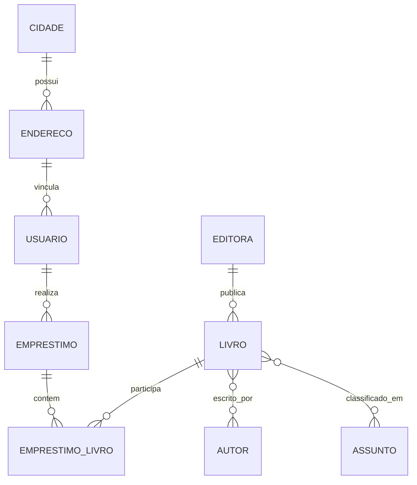

# Sistema de Biblioteca — Banco de Dados MySQL

Projeto acadêmico desenvolvido na disciplina de **Banco de Dados I** do curso de **Análise e Desenvolvimento de Sistemas no IFRS Erechim**.

O objetivo do trabalho é modelar um banco de dados relacional para controle de uma biblioteca, contemplando usuários, endereços, livros, autores, editoras, assuntos e empréstimos.

## O que este projeto demonstra

- modelagem de entidades e relacionamentos;
- chaves primárias e estrangeiras;
- relacionamentos 1:N e N:N;
- normalização de dados;
- criação de tabelas com MySQL;
- constraints e integridade referencial;
- operações `INSERT`, `UPDATE` e `SELECT`;
- consultas com `JOIN`, agregações e `GROUP BY`.

## Modelo atual



## Estrutura do repositório

```text
Cod/
└── ProjectCod              # versão original do trabalho acadêmico

database/
├── schema.sql              # estrutura revisada e corrigida
├── seed.sql                # dados de demonstração
└── queries.sql             # consultas de exemplo
```

## Evolução do projeto

O arquivo `Cod/ProjectCod` foi mantido propositalmente como registro da versão entregue durante a disciplina.

A pasta `database/` contém uma revisão posterior da modelagem, corrigindo inconsistências da primeira versão e aplicando práticas que aprendi depois, como:

- nomenclatura consistente;
- tipos de dados mais adequados;
- relacionamento explícito entre livros e autores;
- chaves compostas nas tabelas associativas;
- campos de empréstimo mais claros;
- índices e restrições de unicidade;
- scripts separados por responsabilidade.

## Executando

Com o MySQL disponível, execute os scripts nesta ordem:

```bash
mysql -u root -p < database/schema.sql
mysql -u root -p biblioteca < database/seed.sql
mysql -u root -p biblioteca < database/queries.sql
```

Também é possível abrir os arquivos diretamente no MySQL Workbench ou em outra ferramenta compatível.

## Principais entidades

| Entidade | Responsabilidade |
|---|---|
| `cidade` | cidades utilizadas nos endereços |
| `endereco` | endereço associado ao usuário |
| `usuario` | pessoas que utilizam a biblioteca |
| `editora` | editoras responsáveis pelos livros |
| `livro` | informações do acervo |
| `autor` | autores das obras |
| `assunto` | categorias e assuntos do acervo |
| `emprestimo` | registro de empréstimos por usuário |
| `emprestimo_livro` | livros vinculados a cada empréstimo |

## Autor

**Pedro Henrique Andrade**  
Análise e Desenvolvimento de Sistemas — IFRS Erechim
